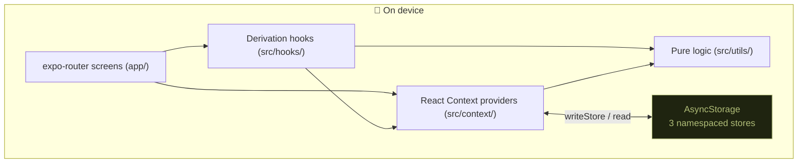
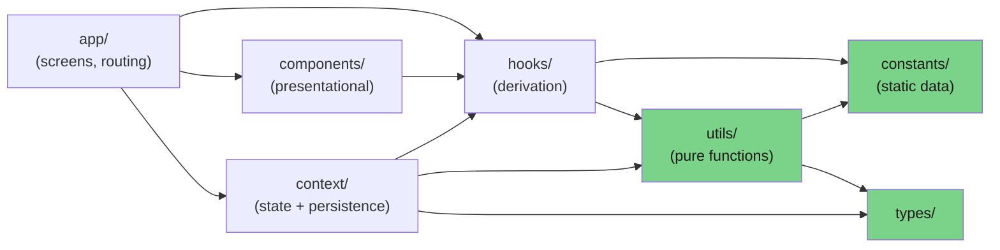
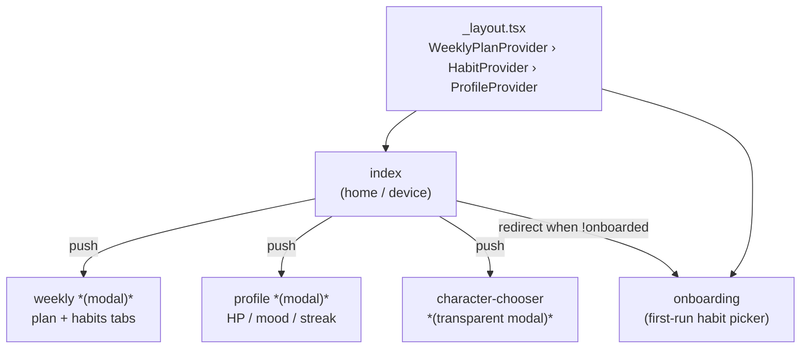
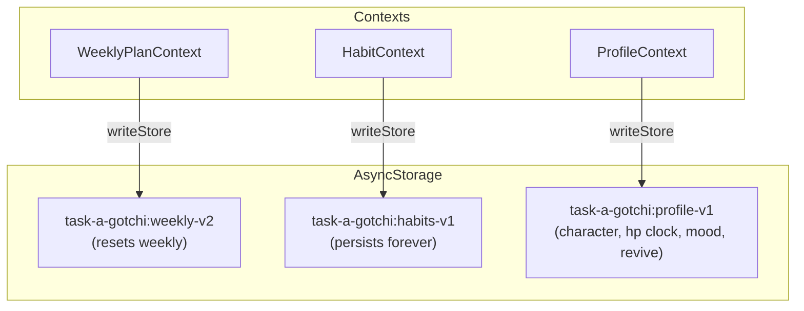
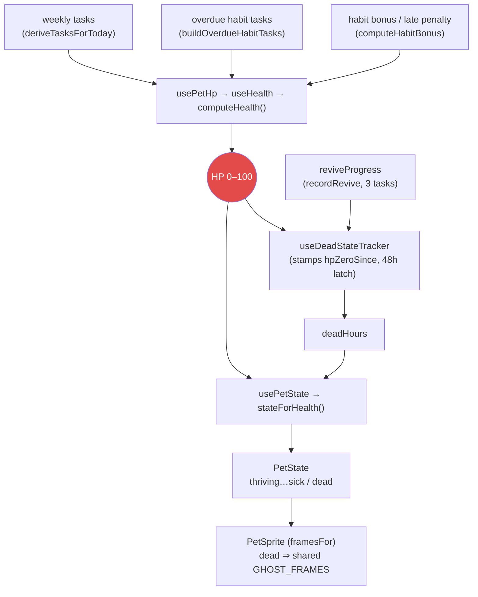

# Architecture

Visual map of how Task-a-gotchi is put together. Companion to
[`DECISIONS.md`](./DECISIONS.md) (the *why* behind specific calls) and
[`../ROADMAP.md`](../ROADMAP.md) (what's next).

> **Maintenance:** update this file in the same PR as any change to the layer boundaries,
> a context/store, the data model, or a core derivation (HP, streak, mood, revive). Diagrams
> are Mermaid — they render on GitHub. Keep them accurate over pretty; a stale diagram is worse
> than none.

---

## 1. System at a glance

A local-first Expo / React Native app. No backend — all state lives on-device in AsyncStorage,
behind a thin persistence seam so a future sync layer has a single insertion point.

---

## 2. Layered dependency rule

Strict one-direction dependency flow. The lower a layer, the more testable and the fewer
imports it's allowed. **`utils` and `constants` are React-free and side-effect-free** — that's
what keeps the core logic unit-tested without a renderer.

**Rules of thumb**
- `constants/` — pure data, no imports from `hooks`/`components`/`context`.
- `utils/` — pure functions; no React, no side effects. Everything here has (or should have) a unit test.
- `hooks/` — stateful derivation; depend on `context` + `utils` + `constants` only.
- `components/` — presentational; receive data via props, don't reach into context where avoidable
  (e.g. `TaskRow` takes a `Task`, it doesn't call `useHabits`).
- `app/` — screens wire it all together; one file = one route (expo-router).

---

## 3. Navigation (expo-router)

Providers nest at the root (`app/_layout.tsx`) in the order **WeeklyPlan → Habit → Profile**
(Profile innermost). Screens are a Stack; three are modals.

---

## 4. State & persistence

Three independent contexts, each owning one AsyncStorage key and persisting through the shared
`writeStore` seam (`src/utils/storage.ts`). The split is deliberate — see
[DECISIONS §1](./DECISIONS.md) (two-store persistence).

| Context | Key | Owns | Reset policy |
|---|---|---|---|
| `WeeklyPlanContext` | `weekly-v2` | templates, one-offs, daily completions, week start | One-offs + completions wiped on week rollover; templates kept |
| `HabitContext` | `habits-v1` | habit definitions + dated completions | Never wiped (history is the point) |
| `ProfileContext` | `profile-v1` | character, colorway, `hpZeroSince`, mood, `reviveProgress`, onboarded | Never wiped |

---

## 5. The core derivation: HP → pet state

The pet is a pure function of completed work. This is the spine of the app.

Key invariants (detailed in DECISIONS):
- **HP is the only lethal stat.** Mood is a parallel, non-lethal layer (`usePetMood`).
- **Dead latch:** once `deadHours ≥ 48` the pet is a ghost; only `recordRevive` (3 tasks) clears it.
- **Streaks are schedule-aware & local-date** (issue #1, resolved).

---

## 6. Module index

| Area | Files (representative) | Responsibility |
|---|---|---|
| Screens | `app/index`, `app/weekly`, `app/profile`, `app/onboarding` | Routing + wiring |
| Device shell | `components/device/*` | Tamagotchi LCD frame, buttons, glyphs |
| Pet | `components/pet/*` | Sprite rendering, HP header, chooser |
| Tasks | `components/tasks/*` | Task list, rows, check circle, habit dots |
| Effects | `components/effects/*` | Hearts burst, food bowl, toast |
| State | `context/*` | The three providers above |
| Derivation | `hooks/*` | `usePetHp`, `usePetState`, `useDeadStateTracker`, `usePetMood`, `useNow`, … |
| Pure logic | `utils/*` | `health`, `habits`, `streak`, `mood`, `revive`, `weeklyPlan`, `storage`, `id`, `format` |
| Static data | `constants/*` | `characters` (sprites), `colors`, `messages`, `suggestedHabits`, `data` |
| Types | `types/index.ts` | Shared TS types |
| Tests | `__tests__/*` | Unit tests for the pure layer |

---

_Last updated: 2026-06-03._
